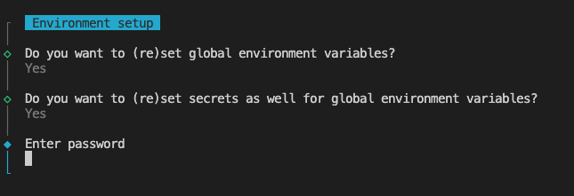
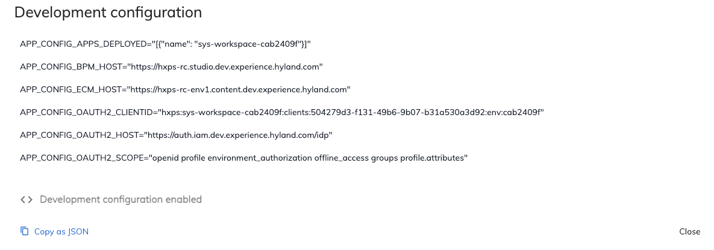

# Experience Workspace

## Prerequisites

- [GitHub Access](https://hyland.atlassian.net/wiki/spaces/ContentCloud/pages/1307986613/HXP-Cloud+Content+On-boarding#2.-Systems-access)
- [GitHub Personal Access Token](https://hyland.atlassian.net/wiki/spaces/GUIL/pages/1303315077/Personal+Access+Token+for+Github+npm+packages)
- [Signing commits](https://hyland.atlassian.net/wiki/spaces/GUIL/pages/1303314640/Signing+commits)
- [Node Version Manager](https://github.com/nvm-sh/nvm)
- [LastPass](https://hyland.atlassian.net/wiki/spaces/GUIL/pages/1303314970/Lastpass+for+CI+and+shared+credentials#How-to-request-a-LastPass-access)

## Repository setup & application start against remote environment

1. Clone the [FE Monorepo](https://github.com/Alfresco/hxp-frontend-apps);
2. Switch to the `develop` branch;
3. Make sure the node version used is the same specified in the _.nvmrc_ file (you can quickly install and use a proper version using NVM: `nvm install` or `nvm use`);
4. Run `npm install`; if an error happens during installation, read the error message carefully: it might suggest the command to fix the issue;
5. Execute `npm run setenv` _(or `VARIANT_ENV_KEY="ci" npm run setenv` to be able to run e2e tests locally. Ideally the tests should work without the CI mode, we use it only as a workaround.)_ to set the remote environment to run the FE against:

    - enter the password stored on LastPass;
    - select the application (usually workspace-hxp);
    - select the remote env (usually RC);

6. Run `npm start workspace-hxp` to verify that FE starts locally without issues;
7. Run workspace-hxp application with a linked deployed app: 
    - A deployed app is an application created with Studio Modeling App and deployed on the remote env with the Studio Admin App.
    - Access the application instances list in the Studio Admin App (using DevOps user from LastPass) on the remote env (eg: RC → [Experience Studio Admin](https://hxps-rc.studio.dev.experience.hyland.com/admin/#/devops/application-instances)) and check the Development configuration (click on the row three dots on the right). Development configuration must be enabled. 
    
    - From the retrieved values you can run the FE locally with a deployed app (pay attention to multiline and escape chars):
        ```bash
        APP_CONFIG_APPS_DEPLOYED="[{\"name\":\"<app-name-with-env-id>\"}]" \
        APP_CONFIG_ECM_HOST="<app-config-ecm-host>" \
        APP_CONFIG_OAUTH2_CLIENTID="<app-client-id>" \
        APP_CONFIG_OAUTH2_SCOPE="<app-scope>" \
        npm start workspace-hxp
        ```
        _you can also replace specific parts in `apps/workspace-hxp/.env` file (although touching .env file is discouraged and everything should be set up via terminal commands) and run `npm start workspace-hxp`_

    - The app will build and launch at `http://localhost:4200/`, and you will be prompted to log in. A few test users are already available with different permissions. The most relevant for the workspace-hxp app are Repo Admin, HR User and Sales User (those users should have been added to the User Access list of the deployed app in the Studio Admin App). The usernames and passwords are defined in `apps/workspace-hxp/.env`

### Alternatives:

## Launch app in development mode against a local repository deployment

Before launching the app, run the following command to launch the local server:

```bash
docker compose up -d --wait
# or from the root of the project: docker compose -f apps/workspace-hxp/docker-compose.yml up -d --wait
```

If you need to use a specific version of the server, please precede the command above with with `HXPR_VERSION="<version>"`. E.g.:

```bash
HXPR_VERSION="1.0.1040" docker compose up -d --wait
```

Now, to run the app in development mode please use the following command at **the root** of your local checkout:

```bash
npm start workspace-hxp
```

The Experience Workspace will be opened in a new browser tab at <http://localhost:4200>.

## Launch app and dependencies locally with Docker

To build and launch a docker image of the Experience Workspace along with the dependencies, please run the following command at **root level**:

```bash
npx nx docker-compose workspace-hxp
```

If you need to use a specific version of the server, please precede the command above with with `HXPR_VERSION="<version>"`.

The Experience Workspace will be available at <http://localhost:8081>.

## Notes

Please notice that docker compose should only be used for local development. Pointing to a remote environment is preferable, as it keeps all dependencies up to date.

## Browser Support

The application is supported in the following browsers:

| **Browser**    | **Version** |
| -------------- | ----------- |
| Chrome         | Latest      |
| Safari (OS X)  | Latest      |
| Firefox        | Latest      |
| Microsoft Edge | Latest      |
