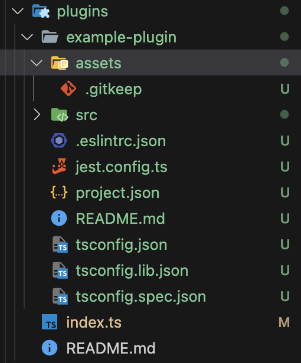
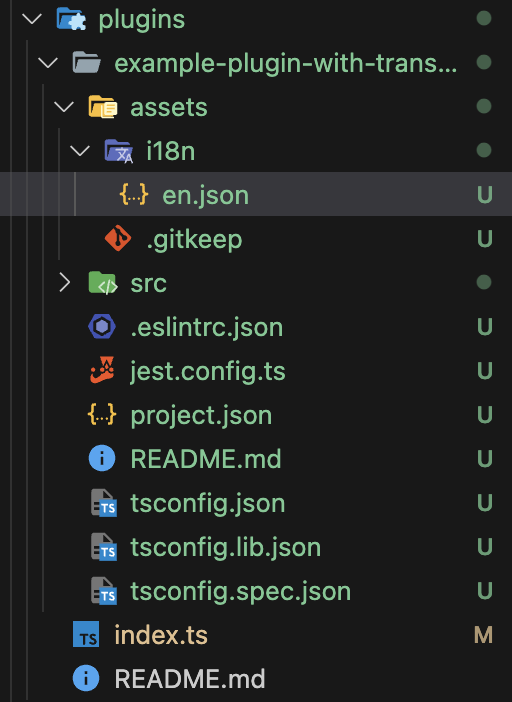

# Plugins Generators

**Please note that this feature is in early phase, therefore it can change in the future**

If you are not famillar with NX generators, plese check [NX documentation](https://nx.dev/core-features/plugin-features/use-code-generators)

Currently we provide the following generators to help you in customizing the application:

- *@hyland/extend - plugin: Create a new plugin library*
- *@hyland/extend - page : Create a new page for specific plugin*
- *@hyland/extend - form-widget: Create a new form widget for specific plugin*

The above plugins can also be used with the NX console.

## Create a Plugin

In order to create a plugin you need to run the following command:

```npx nx generate @hyland/extend:plugin```

After running the command, the new plugin is going to be created in `libs/plugins`

### Schema

Create plugin schema inherits from NX angular library generator, except for options related to changing library directory and removing the main module.

| Name | Description | Required | Default |
| --- | ----------- | ----------| ------- |
| name | Name of the plugin | Yes | |
| author | Author of the plugin | No | |
| addTranslations | Add translations to the plugin | No | false |

### Managing assets

When creating a plugin, an assets folder is created in the plugin's directory. This folder is used to store all assets that are going to be used in the plugin. The assets are going to be copied to the dist folder when the application is built.



In order to use an asset in the plugin, you need to add it to the assets folder and reference it by path `assets/<plugin-name>/<asset-name>`. For example, an image 'example-image.png' in the assets folder of the plugin 'example-plugin' should be referenced as `assets/example-plugin/example-image.png`.

### Managing Translations

When the `addTranslations` option is set to true, a translations folder with a default translation file `en.json` is going to be created in the assets folder of the plugin. The plugin module is going to be configured to load the translations.



To use translations you need to create a new key in your translation file and use it in your code, for example:

`en.json:`
```json
{
  "EXAMPLE_PLUGIN": {
    "EXAMPLE_PAGE": {
        "TITLE": "Example page"
    }
  }
}
```

`example .html file in your plugin:`
```html
<h1>{{ 'EXAMPLE_PLUGIN.EXAMPLE_PAGE.TITLE' | translate }}</h1>
```

If you want to learn more about translations, please check [ngx-translate/core](https://github.com/ngx-translate/core/blob/master/README.md)

## Create a Page

To create a page you need to have created a plugin first. Then you can run the following command:

```npx nx generate @hyland/extend:page```

You need to select the plugin in which you would like to create a page (plugin names start with the 'plugins' prefix, therefore in the list of plugins you can search for 'plugins' to display all available plugins).

Next, you need to provide a name for the page.

When the command completes, new entry point should be added into the sidenav panel. After clicking it, you should see your page.

### Schema

| Name | Description | Required |
| --- | ----------- | ----------|
| pluginName | Plugin in which the page is going to be created | Yes |
| pageName | Name of the new page | Yes |

## Create a Custom Form Widget
The Studio Modeling App allows you to create custom form widgets. These widgets can then be rendered inside forms, just like the default ones.
To create a form widget you need to have created a plugin first. Then you can run the following command:

```npx nx generate @hyland/extend:form-widget```

You need to select the plugin in which you would like to create a form-widget (plugin names start with the 'plugins' prefix, therefore in the list of plugins you can search for 'plugins' to display all available plugins).

Next, you need to provide a name for the widget. **This name needs to be the same as the one provided in the modeling application.**

When the command completes, all forms containing the widget should render it properly.

### Schema

| Name | Description | Required |
| --- | ----------- | ----------|
| pluginName | Plugin in which the page is going to be created | Yes |
| formWidgetName | Name of the new form widget | Yes |

